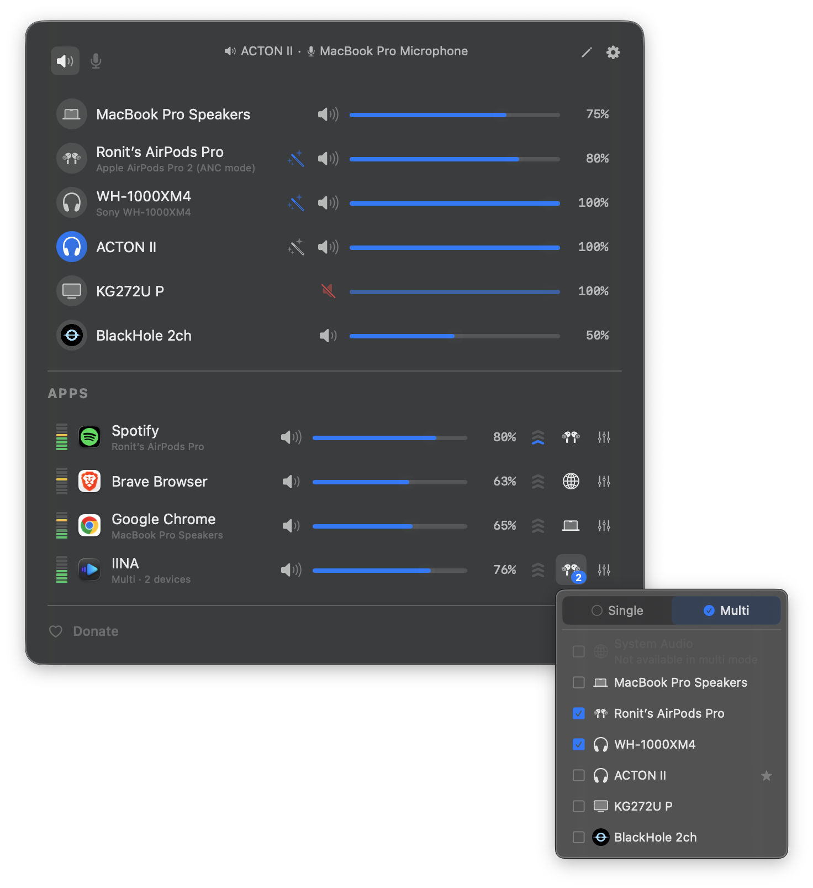

<h3>FineTune</h3>

Control the volume of every app independently, boost quiet ones up to 4x, route audio to different speakers, and shape your sound with EQ and headphone correction. Lives in your menu bar. Free and open-source.

<a href="https://github.com/ronitsingh10/FineTune/releases/latest/download/FineTune.dmg"></a>

<br clear="all"/>

<p align="center">
  <a href="https://github.com/ronitsingh10/FineTune/releases/latest"></a>
  <a href="https://github.com/ronitsingh10/FineTune/releases"></a>
  <a href="LICENSE"></a>
  <a href="https://ko-fi.com/ronitsingh10"></a>
  <a href="https://www.apple.com/macos/"></a>
</p>

<p align="center">
  <strong>English</strong> · <a href="README.zh-CN.md">简体中文</a>
</p>

<p align="center">
  
</p>
<p align="center">
  
</p>

## Install

**Homebrew** (recommended)

```bash
brew install --cask finetune
```

**Manual** — [Download latest release](https://github.com/ronitsingh10/FineTune/releases/latest)

## Quick Start

1. Install FineTune and launch it from your Applications folder
2. Grant **Screen & System Audio Recording** permission when prompted
3. Click the FineTune icon in your menu bar. Apps playing audio appear automatically.

That's it. Adjust sliders, route audio, and explore EQ from the menu bar.

> **Tip:** Want FineTune to auto-switch to a specific device when you connect it? Open edit mode (pencil icon) and drag it above the built-in speakers. This is a one-time setup. Your preferred order is saved permanently.

## Features

### 🎚 Volume Control
- **Per-app volume** — Individual sliders and mute for each application
- **Per-app volume boost** — 2x / 3x / 4x gain presets
- **Pinned apps** — Keep apps visible in the menu bar even when they're not playing, so you can configure volume, EQ, and routing in advance
- **Ignore apps** — Completely disengage FineTune from specific apps. Tears down the audio tap so the app returns to normal macOS audio
- **Scroll-wheel volume** — Hover any slider in the popup, the HUD, or the EQ panel and scroll to adjust.

### ⌨️ Keyboard
- **Global volume hotkeys** — Bind your own keys to **App Volume Up**, **App Volume Down**, and **App Mute** from Settings → Shortcuts. The "app" is whichever is currently making sound, so volume-down while a YouTube tab plays behind a foreground Terminal turns down YouTube, not the terminal. If nothing is audible, the hotkey falls through to the frontmost app.
- **Toggle the popup from anywhere** — Bind a hotkey to **Toggle FineTune Popup** and the menu bar opens or closes on demand, including from full-screen apps.
- **Configurable step size** — Pick **Coarse / Normal / Fine / Extra-Fine** under Settings → Shortcuts → Volume Step. The same setting governs the global hotkeys and the popup's arrow-key navigation.
- **Hold to ramp, auto-unmute on volume-up** — Holding App Volume Up or Down emits repeats the way macOS does for arrow keys. Volume-up while muted unmutes and sets the new level in one keystroke.
- **Drive the popup with the keyboard** — Once the popup is open, **↑ / ↓** move between rows, **← / →** adjusts the focused row's volume (Shift = 2× step), **M** toggles mute, **Return / Space** activates, **Tab** switches between Output and Input device tabs, **Esc** closes. The focused row autoscrolls to center as you arrow through.

### 🔀 Audio Routing
- **Multi-device output** — Route audio to multiple devices simultaneously
- **Audio routing** — Send apps to different outputs or follow system default
- **Device priority** — Choose which device FineTune switches to when a new device connects; auto-fallback on disconnect
- **Auto-restore** — When a device reconnects, apps automatically return to it with their volume, routing, and EQ intact

### 🎛 EQ & Correction
- **10-band EQ** — 20 presets across 5 categories
- **User EQ presets** — Save, rename, and manage custom EQ configurations per app
- **AutoEQ headphone correction** — Search thousands of headphone profiles or import your own ParametricEQ.txt files for per-device frequency response correction
- **Loudness compensation** — Automatic bass and treble correction at low volumes using ISO 226:2023 equal-loudness contours, with real-time level management to keep perceived loudness consistent

### 🖥 Devices & System
- **Input device control** — Monitor and adjust microphone levels
- **Alert volume** — Control macOS notification and alert volume from settings
- **Smart volume backend** — FineTune auto-picks hardware, DDC, or software volume per device. If the hardware slider on a USB DAC or HDMI output doesn't actually control level, force software volume from the device inspector and FineTune remembers the choice for that device
- **Device inspector** — Tap the info button on any device row for sample rate (with picker), transport, UID copy, hog-mode banner, and the software-volume override
- **Hide devices** — Eye toggle in edit mode hides output and input devices you don't want in the list, mirroring the app-hide flow
- **Bluetooth device management** — Connect paired devices directly from the menu bar
- **Monitor speaker control** — Adjust volume on external displays via DDC
- **Dynamic menu bar icon** — Pick from four styles in Settings (Default, Speaker, Waveform, Equalizer). The **Speaker** style tracks volume live (zero / low / mid / high glyphs) and switches to a slashed speaker when muted. All styles briefly flash the new output's SF Symbol on device switch. Changing style applies instantly, no relaunch required.
- **Menu bar app** — Lightweight, always accessible
- **URL schemes** — Automate volume, mute, device routing, and more from scripts

### 🎨 Appearance
- **Light or Dark theme** — Settings → General → Theme matches macOS or locks FineTune to Light or Dark. The menu bar popup, every popover, and the volume HUD switch immediately.
- **Popup density** — Settings → General → Popup Size picks **Compact / Comfortable / Spacious** with a live tile preview. Compact fits more apps on small screens; Spacious gives bigger hit areas for trackpads.

## Documentation

- **[AutoEQ & Headphone Correction](guide/autoeq.md)** — Apply frequency correction from the [AutoEQ](https://github.com/jaakkopasanen/AutoEq) project, import [EqualizerAPO](https://sourceforge.net/projects/equalizerapo/) profiles, or browse [autoeq.app](https://www.autoeq.app/)
- **[URL Schemes](guide/url-schemes.md)** — Automate FineTune from Terminal, [Shortcuts](https://support.apple.com/guide/shortcuts-mac), [Raycast](https://raycast.com), or scripts
- **[Troubleshooting](guide/troubleshooting.md)** — Permission issues, missing apps, audio problems

## Contributing

- **Star this repo** — Help others discover FineTune
- **Report bugs** — [Open an issue](https://github.com/ronitsingh10/FineTune/issues)
- **Contribute code** — See [CONTRIBUTING.md](CONTRIBUTING.md)

### Build from Source

```bash
git clone https://github.com/ronitsingh10/FineTune.git
cd FineTune
open FineTune.xcodeproj
```

## Requirements

- macOS 15.0 (Sequoia) or later
- Audio capture permission (prompted on first launch)

## Support

FineTune is free and open source, forever. If it made your day a little easier, you can buy me a coffee — but genuinely not expected 🙏

[](https://ko-fi.com/ronitsingh10)


## License

[GPL v3](LICENSE)
